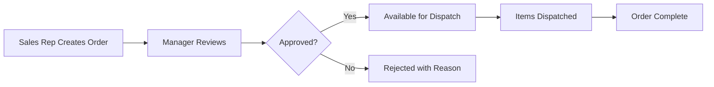

<div align="center">
  
  # 📱 OMA - Order Management App
  
  **A comprehensive React Native order management system for sales teams**
  
  [](https://reactnative.dev/)
  [](https://expo.dev/)
  [](https://www.typescriptlang.org/)
  [](LICENSE)
  
  [📱 Download APK](https://github.com/AryanXPatel/OMA-Order-Management-App/releases) • [🌐 Web Demo](https://oma-order-management-app.vercel.app) • [🔧 Backend Server](https://github.com/AryanXPatel/OMA-DEMO-SERVER)
  
</div>

---

## 🎯 **What This App Does**

OMA is a **complete order management solution** designed for sales teams to efficiently manage customers, products, and orders. Built with React Native and Expo, it integrates with Google Sheets as a database and provides a seamless workflow from order creation to dispatch.

### 🏗️ **System Architecture**
📱 React Native App → 🔧 Express API Server → 📊 Google Sheets Database


- **Frontend**: This repository (React Native + Expo)
- **Backend**: [OMA Demo Server](https://github.com/AryanXPatel/OMA-DEMO-SERVER) (Node.js + Express)
- **Database**: [Google Sheets](https://docs.google.com/spreadsheets/d/169NezkhUQScyX95jnTy4vAnT0MqJ27SEiFmJI2N1oL4) integration

---

## 🎮 **What's Been Built - Core Features**

### 📋 **1. Order Management System**
- **New Order Creation** ([`new-order.tsx`](app/(app)/new-order.tsx))
  - Customer selection with search functionality
  - Product selection with real-time pricing
  - Quantity management and order calculations
  - Custom date/time selection with validation
  - Order comments and source tracking
  - Indian number formatting (₹1,25,000.00)

- **Order Tracking** ([`my-orders.tsx`](app/(app)/my-orders.tsx))
  - Personal order history by user role
  - Status tracking (Pending/Approved/Rejected/Dispatched)
  - Order details with product breakdown
  - Search and filter capabilities

### 👥 **2. Customer Management**
- **Customer Database** ([`customers.tsx`](app/(app)/customers.tsx))
  - Searchable customer directory
  - Contact information management
  - Direct calling and WhatsApp integration
  
- **Customer Analytics** ([`customer-summary.tsx`](app/(app)/customer-summary.tsx))
  - Ledger balance calculations
  - Order history and spending patterns
  - Credit/Debit tracking

### ✅ **3. Approval Workflow** 
- **Manager Approval System** ([`order-approval.tsx`](app/(app)/order-approval.tsx))
  - Role-based access (Manager only)
  - Bulk order review and approval
  - Rejection with reason tracking
  - Customer ledger integration for approval decisions

### 🚚 **4. Dispatch Management**
- **Order Processing** ([`process-orders.tsx`](app/(app)/process-orders.tsx))
  - Approved order queue management
  - Individual product dispatch tracking
  - Dispatch comments and timestamps
  - Real-time status updates

### 📊 **5. Dashboard & Analytics**
- **Main Dashboard** ([`main.tsx`](app/(app)/main.tsx))
  - Live order statistics
  - Pending approvals count
  - Pending dispatch queue
  - Recent order activity
  - Quick navigation to all features

### 📱 **6. User Experience Features**
- **Authentication System** ([`login.tsx`](app/(auth)/login.tsx))
  - Role-based login (Sales Rep/Manager/Admin)
  - Session management
  - Server wake-up and data preloading

- **Theme System**
  - Dark/Light mode toggle
  - Consistent theming across all screens
  - User preference persistence

---

## 🔧 **Technical Implementation**

### **Built With**
- **React Native** with Expo framework
- **Expo Router** for file-based navigation
- **Context API** for state management
- **AsyncStorage** for local data caching
- **Google Sheets API** integration via backend
- **React Native Paper** components
- **React Native Reanimated** for smooth animations

### **Key Technical Features**
- **Offline-First Design**: Local caching with API fallbacks
- **Real-time Data Sync**: Live updates from Google Sheets
- **Performance Optimized**: Memoized components and efficient rendering
- **Responsive Design**: Works on phones and tablets
- **Error Handling**: Comprehensive error states and retry logic

---

## 🚀 **Quick Start**

### Prerequisites
```bash
Node.js >= 16.0.0
npm >= 8.0.0
Expo CLI
```

### Installation

1. **Clone the repository**
   ```bash
   git clone https://github.com/AryanXPatel/OMA-Order-Management-App.git
   cd OMA-Order-Management-App
   ```

2. **Install dependencies**
   ```bash
   npm install
   ```
3. **Setup backend server (Required)**
   ```bash
   git clone https://github.com/AryanXPatel/OMA-DEMO-SERVER.git
   cd OMA-DEMO-SERVER
   npm install && npm start
   ```
4. **Start the app**
  ```bash
   npx expo start
   ```
5. **Run on your preferred platform**
   - Press `i` for iOS Simulator
   - Press `a` for Android Emulator  
   - Press `w` for Web browser
   - Scan QR code with Expo Go app on your device
---

## 📂 **Project Structure**

```
app/
├── (app)/                 # Protected app routes
│   ├── [main.tsx](http://_vscodecontentref_/0)          # Dashboard with live statistics
│   ├── [new-order.tsx](http://_vscodecontentref_/1)     # Order creation workflow
│   ├── [my-orders.tsx](http://_vscodecontentref_/2)     # Personal order history
│   ├── [order-approval.tsx](http://_vscodecontentref_/3) # Manager approval interface
│   ├── [process-orders.tsx](http://_vscodecontentref_/4) # Dispatch management
│   ├── [customers.tsx](http://_vscodecontentref_/5)     # Customer directory
│   ├── [customer-summary.tsx](http://_vscodecontentref_/6) # Customer analytics
│   └── [order-details.tsx](http://_vscodecontentref_/7) # Detailed order view
├── (auth)/               # Authentication
│   └── [login.tsx](http://_vscodecontentref_/8)         # Role-based login
├── components/           # Reusable components
├── context/              # React Context providers
├── utils/                # Utility functions
└── _layout.tsx           # Root layout with navigation
```
---
## 👥 User Roles & Capabilities
| Role      | Capabilities                                                   |
|-----------|---------------------------------------------------------------|
| Sales Rep | Create orders, view own orders, access customer data          |
| Manager   | All sales rep features + order approval, view all orders      |
| Admin     | Full system access (future implementation)                    |

---
## 🔄 Order Workflow

---
## 📊 Data Integration
The app uses Google Sheets as its database with these tables:

- `Customer_Master`: Customer information and codes
- `Product_Master`: Product catalog with pricing
- `New_Order_Table`: Complete order lifecycle tracking
- `Customer_Ledger_2`: Financial transaction records

- [Google Sheets Template: View Database](https://docs.google.com/spreadsheets/d/169NezkhUQScyX95jnTy4vAnT0MqJ27SEiFmJI2N1oL4/edit?usp=sharing)
---
## 🚀 Deployment
Mobile App Build

```
# Install EAS CLI
npm install -g @expo/eas-cli

# Build APK
eas build --platform android --profile production
```
#### Web Deployment
- Live Web App: oma-order-management-app.vercel.app
- Deployed via Vercel with automatic GitHub integration
---
## 🔮 Future Enhancements
- <input disabled="" type="checkbox"> Analytics dashboard (currently in development)
- <input disabled="" type="checkbox"> Push notifications for order updates
- <input disabled="" type="checkbox"> Barcode scanning for products
- <input disabled="" type="checkbox"> Offline data sync capabilities
- <input disabled="" type="checkbox"> Multi-language support
- <input disabled="" type="checkbox"> Advanced reporting features

---
## 🤝 Contributing
1. Fork the repository
2. Create your feature branch (git checkout -b feature/amazing-feature)
3. Commit your changes (git commit -m 'Add amazing feature')
4. Push to the branch (git push origin feature/amazing-feature)
5. Open a Pull Request
---
### 📄 License
- This project is licensed under the MIT License - see the LICENSE file for details.
---
### 🔗 Related Links
- 🔧 Backend Server: [OMA-DEMO-SERVER](https://github.com/AryanXPatel/OMA-DEMO-SERVER)
- 📊 Database Template: [Google Sheets](https://docs.google.com/spreadsheets/d/169NezkhUQScyX95jnTy4vAnT0MqJ27SEiFmJI2N1oL4)
- 🌐 Live Demo: [Web App](https://oma-order-management-app.vercel.app)
- 📱 Download: [APK Releases](https://github.com/AryanXPatel/OMA-Order-Management-App/releases)
---
## 👨‍💻 Developer
#### Aryan Patel


- GitHub: [@AryanXPatel](https://github.com/AryanXPatel)
- LinkedIn: [Connect with me](https://linkedin.com/in/aryanxpatel)
---
<div align="center">
⭐ Star this repository if it helped you!

Made with ❤️ for efficient order management

</div>
